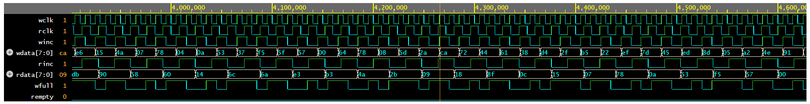
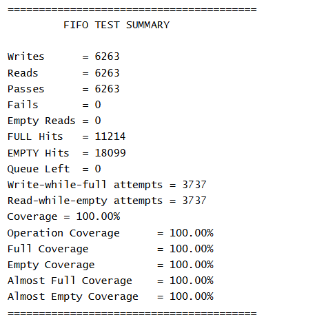

# Async FIFO Verification using Layered SystemVerilog Testbench

## Overview

This project implements functional verification of an Asynchronous FIFO using a layered SystemVerilog testbench architecture, applying industry-standard verification methodology developed from scratch without UVM. The environment focuses on constrained-random stimulus generation, scoreboard-based data checking, SystemVerilog Assertions (SVA), and functional coverage.

The DUT is an asynchronous FIFO that uses Gray-coded pointers and clock-domain crossing (CDC) synchronizers to safely transfer data between independent write and read clock domains.

---

## DUT Reference

RTL sourced from:

**https://github.com/dpretet/async_fifo**

The design is inspired by Clifford Cummings' industry-standard paper *"Simulation and Synthesis Techniques for Asynchronous FIFO Design"* and is widely used in production projects.

### DUT Features

- Independent write and read clock domains
- Gray-coded read/write pointers
- Two-stage CDC synchronizers
- Full and empty flag generation
- Almost-full and almost-empty flag generation
- Parameterized data width and address width

---

## Objectives

- Verify correct FIFO data ordering (first-in, first-out behaviour)
- Verify correct operation across independent write and read clock domains
- Exercise full, empty, almost-full, and almost-empty boundary conditions
- Detect and validate overflow and underflow protection
- Validate reset behaviour across both clock domains
- Achieve 100% functional coverage using constrained-random verification

---

## Verification Environment Architecture

```text
                +-------------+
                |   Generator |
                +------+------+
                       |
                       v
                +-------------+
                |   Driver    |
                +------+------+
                       |
                       v
+-----------+    +-------------+    +-------------+
| Assertions|<-->|     DUT     |<-->|   Monitor   |
+-----------+    +-------------+    +------+------+
                                            |
                                            v
                                     +-------------+
                                     | Scoreboard  |
                                     +-------------+
```

---

## Verification Components

### Transaction

Models FIFO operations with the following fields:

- Write enable (`winc`)
- Read enable (`rinc`)
- Write data (`wdata`)
- Read data (`rdata`)

Constrained-random stimulus exercises diverse FIFO operating conditions including simultaneous read/write, idle cycles, and boundary conditions.

---

### Generator

Creates constrained-random FIFO transactions including:

- Random write and read operations
- Idle cycle insertion
- Random write data generation

Separate mailboxes are used for write and read streams to accurately model asynchronous FIFO behaviour across independent clock domains.

---

### Driver

Converts transactions into pin-level stimulus on the FIFO interface:

- Drives write requests synchronised to the write clock domain
- Drives read requests synchronised to the read clock domain
- Handles fully independent write and read timing

---

### Monitor

Observes DUT activity and collects:

- Successful write and read transactions
- Full and empty flag occurrences
- Functional coverage samples

---

### Scoreboard

Implements a reference FIFO model using a SystemVerilog queue:

- Pushes expected write data into the reference queue
- Pops and compares expected data against actual DUT output on every read
- Reports per-transaction PASS/FAIL status and final statistics

---

## SystemVerilog Assertions (SVA)

### Overflow Protection

```systemverilog
(vif.winc && vif.wfull) |=> vif.wfull
```

Verifies the FIFO remains full after a write-while-full attempt.

---

### Underflow Protection

```systemverilog
(vif.rinc && vif.rempty) |=> vif.rempty
```

Verifies the FIFO remains empty after a read-while-empty attempt.

---

### Reset Behaviour

#### Write Domain

```systemverilog
!vif.wrst_n |-> !vif.wfull
```

Verifies the FIFO is not full during active reset on the write domain.

#### Read Domain

```systemverilog
!vif.rrst_n |-> vif.rempty
```

Verifies the FIFO is empty during active reset on the read domain.

---

## Functional Coverage

Coverage was sampled inside the monitor to ensure actual DUT activity was captured.

### Coverpoints

#### FIFO Operations
- Idle
- Read only
- Write only
- Simultaneous read and write

#### FIFO Status Flags
- Full
- Empty
- Almost full
- Almost empty

### Cross Coverage
- Operation × Full flag
- Operation × Empty flag

---

## Verification Results

### Regression Configuration

| Parameter | Value |
|-----------|-------|
| Write requests generated | 10,000 |
| Read requests generated | 10,000 |
| Clock domains | 2 (independent) |

### Scoreboard Summary

```text
Writes                     = 6263
Reads                      = 6263
Passes                     = 6263
Fails                      = 0

FULL Hits                  = 11214
EMPTY Hits                 = 18099

Write-while-full attempts  = 3737
Read-while-empty attempts  = 3737
```

### Coverage Summary

| Metric | Result |
|--------|--------|
| Overall Functional Coverage | 100% |
| Operation Coverage | 100% |
| Full Flag Coverage | 100% |
| Empty Flag Coverage | 100% |
| Almost Full Coverage | 100% |
| Almost Empty Coverage | 100% |

### Key Observations

- Zero data mismatches across 6263 transactions
- Overflow and underflow attempts correctly handled with no data corruption
- Full and empty boundary conditions exercised extensively
- All four SVA assertions passed with zero violations
- 100% functional coverage achieved across all coverpoints and cross-coverage bins

---

## Waveforms





---

## Tools Used

- SystemVerilog
- Synopsys VCS
- EDA Playground
- EPWave

---

## Skills Demonstrated

- Layered Testbench Architecture
- SystemVerilog OOP
- Virtual Interfaces
- Mailbox-based Communication
- Constrained-Random Verification (CRV)
- Functional Coverage with Covergroups and Cross Coverage
- SystemVerilog Assertions (SVA)
- Self-Checking Scoreboard with Reference Model
- Clock Domain Crossing (CDC) Verification
- Asynchronous FIFO Protocol Verification
- Waveform Analysis and Debugging

---

## Future Improvements

- Burst traffic generation for sustained write/read stress testing
- Directed error injection tests
- Coverage-driven randomization
- UVM-based implementation
- Formal verification of FIFO properties

---

## Author

Chetana V | NIT Calicut  
GitHub: [github.com/chetana-nitc](https://github.com/chetana-nitc)
